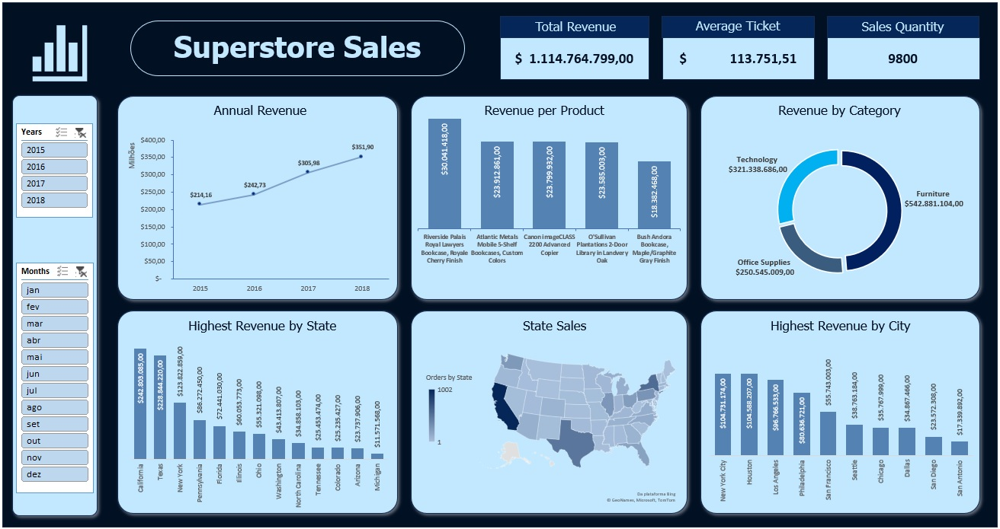

# Análise de Vendas com Excel

## Objetivo

Analisar desempenho de vendas da 'Superstore', realizando acompanhamento de indicadores-chave, identificando produtos mais vendidos por categorias e realizando uma análise temporal.

## Visualização

## Fonte de Dados

Arquivo .csv com os dados retirados da plataforma Kaggle: https://www.kaggle.com/datasets/rohitsahoo/sales-forecasting/data 

## Procedimentos

1. Limpeza e tratamento de dados inconsistentes.

2. Adição de colunas calculadas.

3. Utilização de tabela dinâmica para execução de cálculos direcionados aos diferentes objetivos.

4. Criação dos gráficos de visualização

5. Relacionando tabelas e gráficos dinâmicos através da conexão de relatórios

6. Estruturação e montagem do dashboard

## Insights 

- A concentração de 70% das vendas está em apenas 6 estados, tendo o primeiro (California) representando aproximadamente 22% do total.

- A receita da loja está numa crescente durante os 4 anos consecutivos.

- O mês de julho é o que mais mantém o nível de estabilidade nas vendas.
